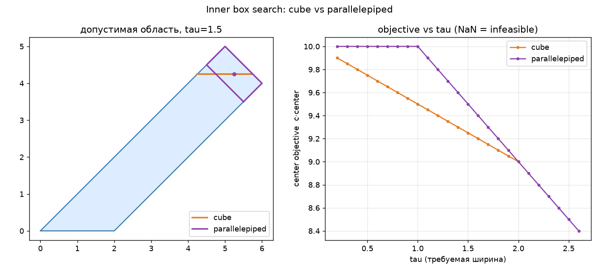
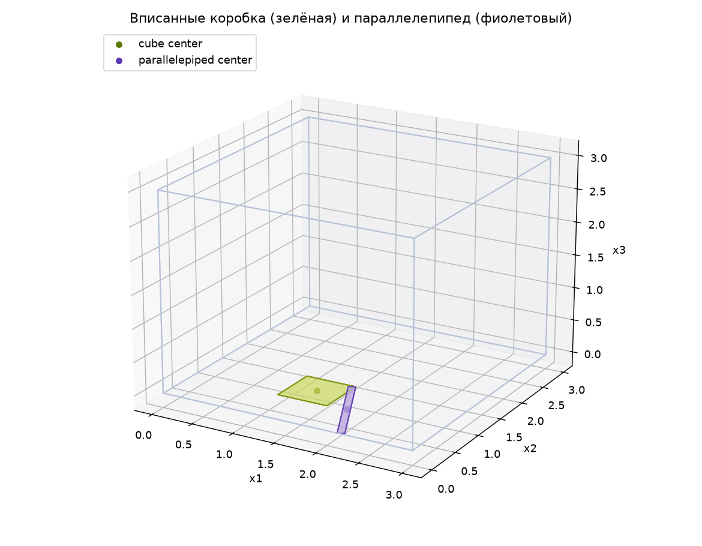

# MCIPS — Maximized-Center Inscribed Parallelepiped Search

Эвристика построения допустимых решений задач смешанно-целочисленного линейного
программирования (**MILP**). Метод вписывает в допустимую область LP-релаксации
тело простой формы (коробку либо параллелепипед) с центром, максимизированным
вдоль направления целевой функции, и извлекает целочисленную вершину этого тела
как кандидат-решение.

Репозиторий сравнивает два семейства вписываемых тел: **axis-aligned коробку**
(кубовый базис `B = I`) и **параллелепипед** с аффинным базисом `B`, и показывает,
что второе строго доминирует первое на анизотропных (наклонных) политопах.



## 1. Постановка

Рассматривается задача

```
max  cᵀx
s.t. A x ≤ b,   l ≤ x ≤ u,   x_i ∈ ℤ  (i ∈ I)
```

где `x ∈ ℝⁿ`, `A ∈ ℝ^{m×n}`, `I ⊆ {1,…,n}` — множество целочисленных
координат. LP-релаксация получается отбрасыванием условия целочисленности.

## 2. Алгоритм MCIPS

Пусть `B ∈ ℝ^{n×n}` — фиксированный (аффинный) базис; вписываемое тело

```
P(center, e) = { center + B t : t ∈ [−e, e] },   e ≥ 0.
```

**Algorithm 1 (MCIPS).**

1. **Inscribe.** Решить вспомогательную LP по переменным `(center, e)`:
   максимизировать `cᵀcenter + γ·Σ e_i` при условии, что все `2ⁿ` вершин `P`
   лежат в допустимой области, а ширина вдоль каждой целочисленной оси не меньше
   порога `τ`.
2. **Round.** Взять вершину `P`, максимальную по `c`, и округлить её
   целочисленные координаты внутрь тела.
3. **Verify.** Проверить кандидата на `A x ≤ b`; при успехе вернуть его.

Ключевой факт: так как базис `B` фиксирован, скалярные произведения
`aₖᵀBᵢ` — константы, поэтому условие «все вершины допустимы» **линейно** по
`(center, e)` и шаг 1 остаётся линейной программой (см. §3).

## 3. Условия допустимости

**Кубовый случай (`B = I`).** Опорная функция коробки `[l, u]`:

```
max_{x∈[l,u]} aₖᵀx = Σ_i ( a_{ki} ≥ 0 ? a_{ki} u_i : a_{ki} l_i ) ≤ b_k.
```

Ширина по целочисленной оси: `u_i − l_i ≥ τ`. Цель `max cᵀ(l + u)`.

**Параллелепипед (аффинный `B`).** Опорная функция параллелепипеда:

```
aₖᵀcenter + Σ_i |aₖᵀBᵢ| · e_i ≤ b_k,          k = 1,…,m,
center_j ± Σ_i |B_{ji}| · e_i ∈ [l_j, u_j],   j = 1,…,n,
2 · Σ_j |B_{ij}| · e_j ≥ τ,                    i ∈ I.
```

При `B = I` эти неравенства сводятся к кубовому случаю — т.е. коробка есть
частный случай параллелепипеда. Полный вывод — в [docs/notes.md](docs/notes.md).

## 4. Почему параллелепипед доминирует куб

В анизотропном (вытянутом, наклонном) политопе требуемую ширину `τ` вдоль
целочисленной оси дешевле «набрать» вдоль направления вытянутости, а не по
координатным осям. Как следствие:

- при росте `τ` кубовая LP становится **несовместной** раньше;
- при совместности обеих `cᵀcenter` у параллелепипеда не меньше, чем у куба.

Обе закономерности видны на графике `cᵀcenter(τ)` (правая панель фигуры выше):
куб уходит в infeasible, параллелепипед продолжает давать кандидатов.



## 5. Установка

```bash
pip install -r requirements.txt
pip install -e .        # import mcips и CLI python -m mcips.solve
```

## 6. Интерфейс

CLI:

```bash
python -m mcips.solve --config configs/demo.yaml
python -m mcips.solve --config configs/demo.yaml --plot out.png
```

Параметры задачи (`c, A, b`, границы, `int_idx`, `τ`, базис `B`) — в
[configs/demo.yaml](configs/demo.yaml).

Пакет `mcips/`:

- `geometry.py` — `Problem`, вершины коробки/параллелепипеда;
- `solver.py` — `solve_box_lp`, `solve_parallelepiped`, `inner_box_search`,
  `parallelepiped_search`;
- `visualization.py` — 2D/3D отрисовка;
- `solve.py` — CLI.

## 7. Эксперименты

```bash
python examples/toy_2d.py                 # 2D наклонный политоп
python examples/cube_vs_parallelepiped.py # sweep по τ + фигура
python examples/parallelepiped_3d.py      # 3D-визуализация
```

`notebooks/experiments.ipynb` вызывает пакетный код `mcips` (без дублирования
логики); черновой прототип с сырым кодом — `notebooks/mcips_prototype.ipynb`.

## 8. Тесты

```bash
pytest -q
```

Проверяют: допустимость вершин, эквивалентность `B = I` кубовой LP, размерности
матриц вспомогательной LP и доминирование параллелепипеда над кубом на наклонном
политопе.

## 9. Отчёт

Черновик статьи (LaTeX) — [report/report.tex](report/report.tex).

## Ограничения

Базис `B` фиксируется извне (перебором угла либо эвристикой ориентации); метод
даёт эвристического кандидата без гарантии оптимальности MILP. Учебно-
исследовательский прототип (МТУСИ).
